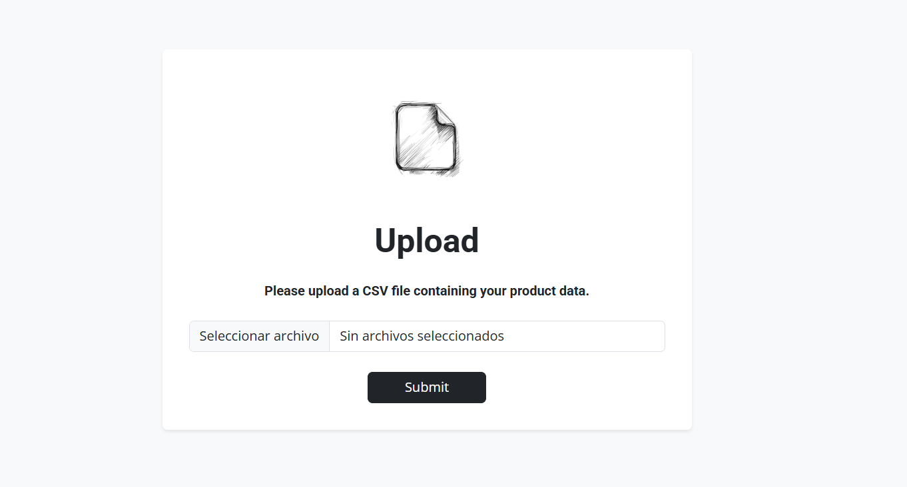
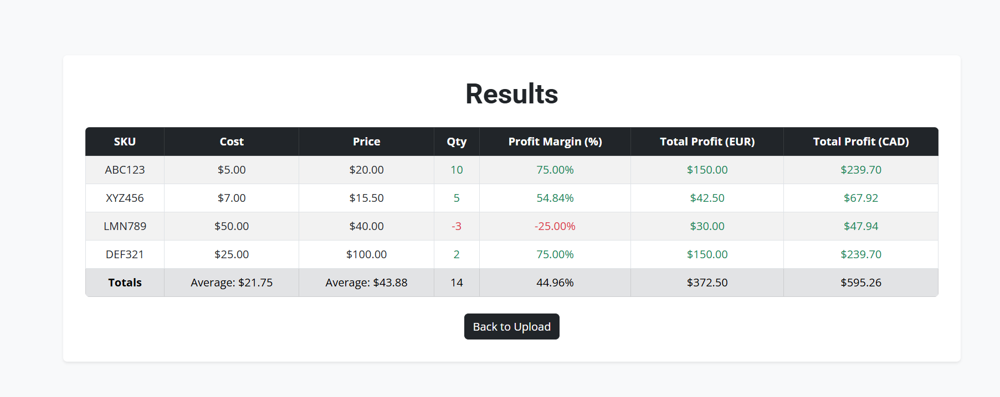

# File Processor PHP Project

## Overview

This application allows users to upload a CSV file with product data, calculates profit margins and totals, and displays the results in a modern Bootstrap-styled HTML table. It also fetches real-time currency conversion rates for profit display in EUR and CAD.

---

## Live Demo

Access the deployed application here: [https://file-processor-rkmt.onrender.com/](https://file-processor-rkmt.onrender.com/)

---

## Screenshots

### Upload Form

### Results Table

---

## How to Run Locally

1. Install PHP 8.x and Composer.
2. Run `composer install` in the project root.
3. Start the server: `php -S localhost:8000`
4. Visit [http://localhost:8000](http://localhost:8000)

---

## How to Run with Docker

1. Build: `docker build -t file-processor .`
2. Run: `docker run -p 8080:80 file-processor`
3. Visit [http://localhost:8080](http://localhost:8080)

---

## Project Structure

- `classes/` — PHP classes (`FileProcessor.php`, `CurrencyConverter.php`)
- `views/` — Result view (`results.php`)
- `public/` — Static files
- `index.php` — Main entry point (upload form)
- `.user.ini` — PHP upload config
- `.htaccess` — Apache config for routing
- `composer.json` — Composer dependencies and scripts
- `.gitignore` — Git ignore rules
- `README.md` — Project documentation
- `LICENSE` — License info

---

## Code Quality

- Run `composer phpcbf` to auto-fix code style to PSR-12.

---

## License

MIT (or your preferred license)
